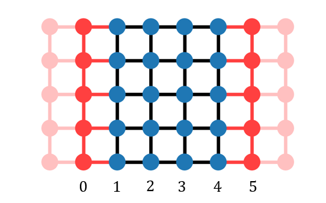
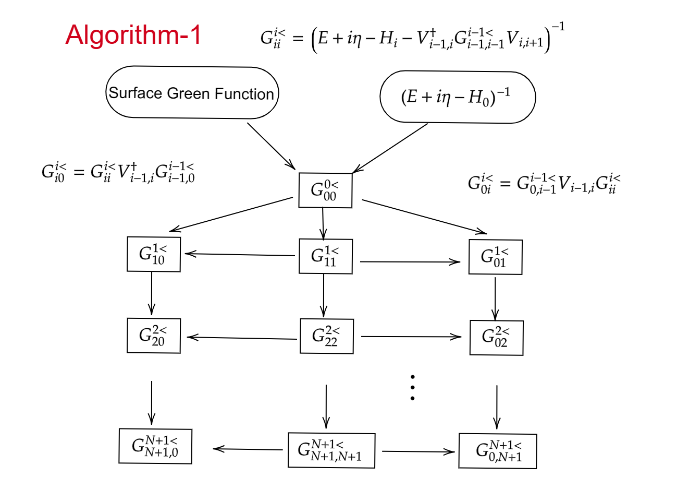
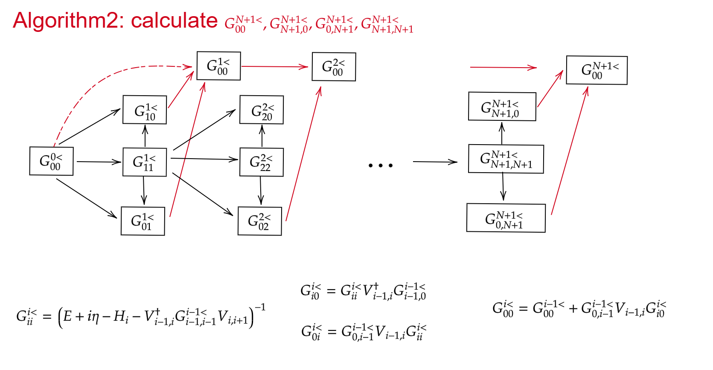

> 这个note是一个迭代计算Green's Function的说明
## Green's Function
$$
G^0=\frac{1}{E+i\eta-H_0}
$$
+ **两层体系**
其中$V$是第0层和第1层的hopping
$$
\begin{align}
    G^{1<}&=G^{1<}_0+G^{1<}_0VG^{1<}=\begin{pmatrix}
    G^{1<}_{0,00}&0\\0&G^{{1<}}_{0,11}
\end{pmatrix}+\begin{pmatrix}
    G^{1<}_{0,00}&0\\0&G^{1<}_{0,11}
\end{pmatrix}\begin{pmatrix}
    0&V_{01}\\V_{01}^\dagger&0
\end{pmatrix}\begin{pmatrix}
    G^{1<}_{00}&G^{1<}_{01}\\G^{1<}_{10}&G^{1<}_{11}
\end{pmatrix}\notag\\
&=\begin{pmatrix}
G_{0,00}^{{1<}}+G_{00}^{1<}V_{01}G^{1<}_{10}&G_{00}^0V_{01}G^{1<}_{11}\\
G_{11}^0V_{01}^\dagger G^{1<}_{00}&G^{{1<}}_{0,11}+G^{0}_{11}V^\dagger_{01}G^{1<}_{01}
\end{pmatrix}
\end{align}
$$
解方程得到
$$
\begin{align}
    G^{1<}_{00}&=G_{0,00}^{{1<}}+G_{0,00}^{1<}V_{01}G^{1<}_{10}\\
    G^{1<}_{01}&=G_{0,00}^{1<}V_{01}G^{1<}_{11}\\
    G^{1<}_{10}&=G_{0,11}^{1<}V_{01}^\dagger G^{1<}_{00}\\
    G^{1<}_{11}&=G^{{1<}}_{0,11}+G^{{1<}}_{0,11}V^\dagger_{01}G^{1<}_{01}
\end{align}
$$
将$G^{1<}_{10}$代入$G^{1<}_{00}$中得到
$$
\begin{align}
    G^{1<}_{00}&=G_{0,00}^{{1<}}+G_{0,00}^{{1<}}V_{01}G_{0,11}^{{1<}}V_{01}^\dagger G^{1<}_{00}\\
    G_{11}^{1<}&=G_{0,11}^{{1<}}+G_{0,11}^{{1<}}V_{01}^\dagger G_{0,00}^{{1<}} V_{01}G_{11}^{1<}
\end{align}
$$
得到$G_{00}^{1<}$, $G_{11}^{1<}$
$$
\begin{align}
    G_{00}^{1<}&=\frac{G_{00}^0}{1-G_{00}^0V_{01}G_{11}^0V_{01}^\dagger}=\frac{1}{E-H_{0}-V_{01}G_{11}^0V_{01}^\dagger}\\
    G_{11}^{1<}&=\frac{G^0_{11}}{1-G_{00}^0V_{01}^\dagger G_{00}^0 V_{01}}=\frac{1}{E-H_1-V_{01}^\dagger G_{00}^0 V_{01}}
\end{align}
$$
这里利用了关系
$$
\begin{align}
    G_{0,00}^{{1<}}&  =\frac{1}{E+i\eta-H_0}\\
    G_{0,11}^{{1<}}&=\frac{1}{E+i\eta-H_1}
\end{align}
$$
现在我们得到了$G_{00}^0$和$G_{11}^0$，这样就可以得到$G^{1<}_{01},G_{10}^{1<}$。$G^{1<}$是系统
$$
\begin{align}
    H=\begin{pmatrix}
        H_0&V_{01}\\V_{10}^\dagger &H_1
    \end{pmatrix}
\end{align}
$$
的格林函数。

+ **三层系统**
现在系统的Hamiltonian为
$$
\begin{align}
    \mathcal{H}=\mathcal{H}_0+V
\end{align}
$$
其中
$$
\begin{align}
    \mathcal{H}_0=\begin{pmatrix}
        H_0&V_{01}&0\\V_{01}^\dagger&H_1&0\\ 0&0^\dagger &H_2
    \end{pmatrix}
&&V=\begin{pmatrix}
    0&0&0\\0&0&V_{12}\\0&V_{12}^\dagger&0
\end{pmatrix}
\end{align}
$$
定义格林函数$G_0^{2<}$为
$$
\begin{align}
    G_0^{2<}&=(E+i\eta-\mathcal{H}_0)^{-1}\notag\\
&=\begin{pmatrix}
        G^{1<}&0\\0&(E+i\eta -H_2)^{-1}
    \end{pmatrix}=\begin{cases}
        G^{1<}_{i,j}&i\&j<2\\
        (E+i\eta-H_2)^{-1}&i=j=2\\
        0&\text{others}
    \end{cases}
\end{align}
$$
同样利用Dyson方程
$$
\begin{align}
    G^{2<}=G^{2<}_0+G^{2<}VG^{2<}
\end{align}
$$
其中
$$
\begin{align}
    V_{ts}=\delta_{t,1}\delta_{s,2}V_{12}+\delta_{t,2}\delta_{s,1}V_{12}^\dagger
\end{align}
$$
写成分量形式为
$$
\begin{align}
    G^{2<}_{\alpha\beta}=G^{2<}_{0,\alpha\beta}+G^{2<}_{0,\alpha t}V_{ts}G^{2<}_{s\beta}=G^{2<}_{0,\alpha\beta}+G^{2<}_{0,\alpha 1}V_{12}G^{2<}_{2\beta}+G^{2<}_{0,\alpha 2}V_{12}^\dagger G^{2<}_{1\beta}
\end{align}
$$
同样先求对角项
$$
\begin{align}
    G^{2<}_{22}&=G^{2<}_{0,22}+G^{2<}_{0,2 1}V_{12}G^{2<}_{22}+G^{2<}_{0,2 2}V_{12}^\dagger G^{2<}_{12}\\
    G^{2<}_{12}&=G^{2<}_{0,12}+G^{2<}_{0,1 1}V_{12}G^{2<}_{22}+G^{2<}_{0,1 2}V_{12}^\dagger G^{2<}_{12}
\end{align}
$$
又因为$G^{2<}_{0,12}=0$，上式可以进一步化简
$$
\begin{align}
    G^{2<}_{22}&=G^{2<}_{0,22}+G^{2<}_{0,2 2}V_{12}^\dagger G^{2<}_{12}\\
    G^{2<}_{12}&=G^{2<}_{0,1 1}V_{12}G^{2<}_{22}
\end{align}
$$
解得
$$
\begin{align}
    &G_{22}^{2<}=\frac{G_{0,22}^{2<}}{1-G_{0,22}^{2<}V_{12}^\dagger G_{0,11}^{2<}V_{12}}=\frac{1}{E+i\eta -H_{2}-V_{12}^\dagger G_{0,11}^{2<}V_{12}}\\
    &G_{02}^{2<}=G^{2<}_{0,01}V_{12}G^{2<}_{22}\\
    &\begin{cases}
    G_{20}^{2<}&=G^{2<}_{0,22}V^\dagger_{12}G^{2<}_{10}\\
    G_{10}^{2<}&=G^{2<}_{0,10}+G^{2<}_{0,11}V_{12}G^{2<}_{20} 
    \end{cases}\to G^{2<}_{20}=G^{2<}_{0,22}V^\dagger_{12}G^{2<}_{0,10}+G^{2<}_{0,22}V^\dagger_{12}G^{2<}_{0,11}V_{12}G_{20}^{2<}\\
    &G_{20}^{2<}=G^{2<}_{22}V^\dagger_{12}G_{0,10}^{2<}\\
    &G_{11}^2=G_{11}^1+G_{11}^1V_{12} G_{21}^2\\
    &\begin{cases}
    G^2_{21}=G^2_{0,22}V^\dag_{12}G_{11}^2=G^2_{0,22}V^\dag_{12}G_{11}^1+G_{0,22}^2V_{12}^\dag G_{11}^1V_{12}G_{21}^2\\
    G_{21}^2=\frac{G_{0,22}^2V^\dag_{12}G^1_{11}}{1-G^2_{0,22}V^\dag_{12}G^1_{11}V_{12}}=G^{2}_{22}V^\dag_{12}G^1_{11}
    \end{cases}\\
    &\to G^2_{11}=G^1_{11}+G^1_{11}V_{12}G^2_{22}V^\dag_{12}G^1_{11}
\end{align}
$$

持续这样下去可以得到
$$
\begin{align}
   G^{i<}_{i,i}&=(E+i\eta-H_i-V_{i-1,i}^\dagger G_{i-1,i-1}^{i-1<}V_{i,i+1})^{-1}\\
   G^{i<}_{0,i}&=G^{i<}_{0,0i-1}V_{i-1,i}G^{i<}_{ii}=G^{i-1<}_{0,i-1}V_{i-1,i}G^{i<}_{ii}\\
   G^{i<}_{i,0}&=G^{i<}_{ii}V_{i-1,i}^\dagger G^{i<}_{0,i-10}=G^{i<}_{ii}V_{i-1,i}^\dagger G^{i-1<}_{i-1,0}\\
   G^{i<}_{00}&=G^{i-1<}_{00}+G^{i-1<}_{0,i-1}V_{i-1,i}G^{i<}_{i0}\\
   G^{N+1}_{jj}&=G^j_{jj}+G^j_{jj}V_{j,j+1}G^{N+1}_{j+1,j+1}V^\dag_{j,j+1}G^{j}_{jj}
\end{align}
$$

---
在计算电导时，我们使用的公式为
$$
\begin{align}
    G_{\ell \ell'}=\frac{e^2}{\hbar}\text{Tr}(\Gamma_{\ell}G^r_S\Gamma_{\ell'}G_S^a)=\frac{e^2}{\hbar}\text{Tr}\left[\Gamma_0^{00}G^r_{05}\Gamma_5^{55}G^a_{50}\right]
\end{align}
$$
其中$\Gamma_\ell=i(\Sigma_\ell^r-\Sigma_\ell^a)$。



$$
\begin{align}
    \Gamma_0=\begin{pmatrix}
        \Gamma_0^{00}&0_{1\times 4}&0\\0&0_{4\times 4}&0\\0&0_{1\times 4}&0
    \end{pmatrix}
\end{align}
$$
**即在计算电导时，我们只需要$G^r_{0N+1}$即可。**

---
## Summary of Algorithms
+ **Algorithm-1** Compute $G_{0,N+1}^{N+1<}$ and $G_{N+1,N+1}^{N+1<}$
    + 计算$G_{i-1,i-1}^{i-1<}$和$G_{0,i-1}^{i-1<}$.

        当没有导线时从$G^{0<}_{00}=(E+i\eta-H_0)^{-1}$开始，接着计算$G^{1<}_{11}$，之后算$G^{1<}_{0,1}$...

+ **Algorithm-2** Compute $G^{N+1<}_{N+1,0},G^{N+1<}_{00}$




```matlab

function self_energy = get_SelfEnergy(obj,lead)
    % import TB_Hamilton.get_tag_TranslationSymmetry;
    [node_gr,gr] = obj.get_lead_gr(lead);
    node1 = [lead.node_V01];
    Inode0 = findnode(obj.system_Graph,node_gr);
    Inode1 = findnode(obj.system_Graph,node1);
    V01 = obj.Hamilton(Inode0,Inode1);
    [~,ia] = intersect(obj.GF_label,node_gr);
    self_energy = spalloc(length(obj.Hamilton),length(obj.Hamilton),length(ia)^2);
    self_energy(ia,ia) = V01'*gr*V01;
end
% two terminal
function CornerGreenFunction(obj)
    % G^i_{0,i} = G^{i-1}_{0,i-1} * V_{i-1,i} * G^i_{ii}
    % G^i_{i,0} = G^i_{ii} * V'_{i-1,i} * G^{i-1}_{i-1,0}
    % G^i_{00} = G^{i-1}_{00} + G^{i-1}_{0,i-1} * V_{i-1,i} * G^i_{i0} 
    % G^0_{00} = gr_L;
    % i = 1,...,N+1
    [~,node1,G0_00] = obj.MGi_ii(0);   
    Gi_i0_ = G0_00;    Gi_0i_ = G0_00;        % Gi_0i_ = Gi_i0_  --->  G0_00
    Gi_00_ = G0_00;
    obj.GF_label(1:length(node1)) = node1;
    for j1 = 1:obj.nlayer
        [node0,node1,Gi_ii] = obj.MGi_ii(j1);
        node1_ = find(obj.GF_label=="",1);
        obj.GF_label(node1_:node1_+length(node1)-1) = node1;
        Ind0 = findnode(obj.system_Graph,node0);
        Ind1 = findnode(obj.system_Graph,node1);
        V_01 = obj.Hamilton(Ind0,Ind1);
        Gi_0i = Gi_0i_ * V_01 * Gi_ii;
        Gi_i0 = Gi_ii * V_01' * Gi_i0_;
        Gi_00 = Gi_00_ + Gi_0i_ * V_01 * Gi_i0;
        Gi_0i_ = Gi_0i; Gi_i0_ = Gi_i0; Gi_00_ =Gi_00;
    end
    Gr_00 = Gi_00;  Gr_0N = Gi_0i;  Gr_N0 = Gi_i0;  Gr_NN = Gi_ii;
    [~,Ind0] = intersect(obj.GF_label,[obj.Leads.node_H0]);
    [~,Ind1] = intersect(obj.GF_label,node1);
    obj.GreenFunction(Ind0,Ind0) = Gr_00;
    obj.GreenFunction(Ind0,Ind1) = Gr_0N;
    obj.GreenFunction(Ind1,Ind0) = Gr_N0;
    obj.GreenFunction(Ind1,Ind1) = Gr_NN;
    ind = findnode(obj.system_Graph,obj.GF_label);
    % [~,ind] = sort(ind);
    obj.GF_pos = obj.GF_pos(ind,:);
end

function DiagGreenFunction(obj)
    % Gr_{j+1,j+1} = G^j_{jj} + G^j_{jj} *
    % V_{j,j+1}*Gr_{j+1,j+1}*V'_{j,j+1}*G^j_{jj}
    obj.CornerGreenFunction;
    [~,~,Gr_NN] = obj.MGi_ii(obj.nlayer);
    % ind = length(Gr_NN)-1;
    for j1 = obj.nlayer-1:-1:1
        [node0,node1,Gi_ii] = obj.MGi_ii(j1);
        node2 = obj.get_next_layer(node0,node1);
        Ind0 = findnode(obj.system_Graph,node1);
        Ind1 = findnode(obj.system_Graph,node2);
        V_01 = obj.Hamilton(Ind0,Ind1);
        Gr_ii = Gi_ii+Gi_ii*V_01*Gr_NN*V_01'*Gi_ii;

        [~,Ind] = intersect(obj.GF_label,node1);
        obj.GreenFunction(Ind,Ind) = Gr_ii;
        % obj.GreenFunction(end-ind-length(Gr_ii):end-ind-1,end-ind-length(Gr_ii):end-ind-1) = Gr_ii;
        % ind = ind + length(Gr_ii);
        Gr_NN = Gr_ii;
    end
end

function node2_end = get_next_layer(obj,node0,node1)
    % node0->node1->node2_end
    % Before-> Now  -> Next
    node2_end = cellfun(@(x) neighbors(obj.system_Graph,x)',node1,'UniformOutput',false);
    node2_end = setdiff(string([node2_end{:}]),[node0,node1]);
end

function [node0,node1,Gi_ii] = getGi_iiByIteration(obj,num) %,Gi_i0,Gi_0i,Gi_00
    % node1 is the label of Gi_ii;
    % This function may be added G^{i}_{i0} for the calculation of  Gr_{i0};
    E = obj.Energy; 
    if num==0
        [node0,Gi_ii] = obj.get_lead_gr(obj.Leads); % G0_00
        node1 = node0;
    else
        [node0,node1,Gi_ii_] = obj.MGi_ii(num-1);
        node2 = obj.get_next_layer(node0,node1);
        Ind0 = findnode(obj.system_Graph,node1);
        Ind1 = findnode(obj.system_Graph,node2);
        Hi = obj.Hamilton(Ind1,Ind1);    V_01 = obj.Hamilton(Ind0,Ind1);    % i-1 ---> i
        Gi_ii = (E*speye(size(Hi))-Hi- V_01'*Gi_ii_ * V_01)\speye(size(Hi));
        node0 = node1;  node1 = node2;
    end
end
```
