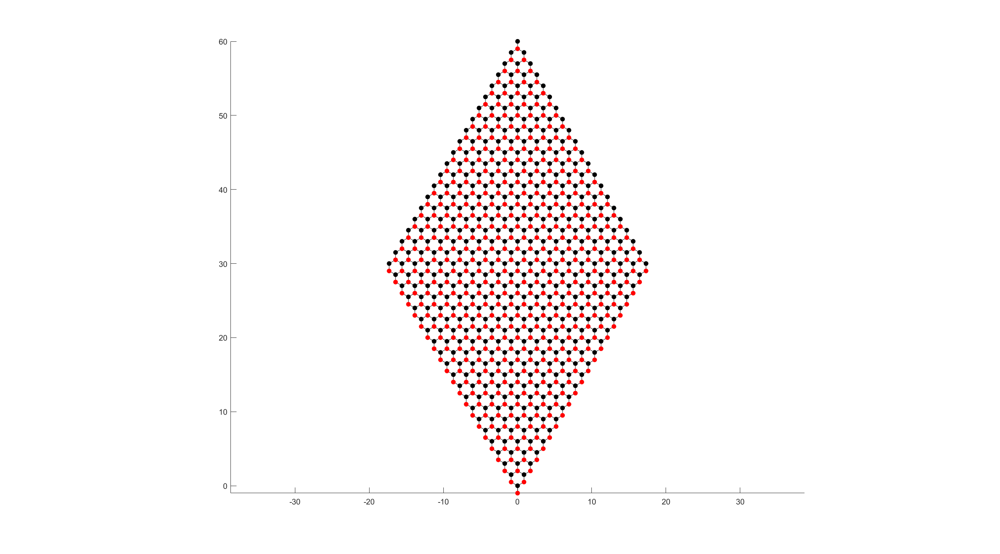
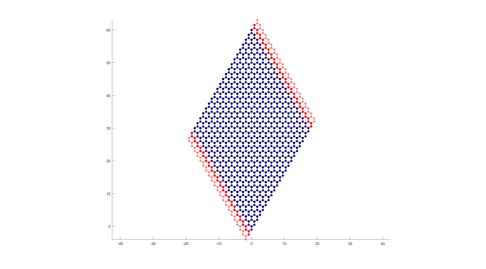
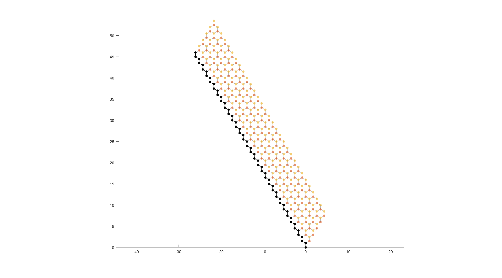
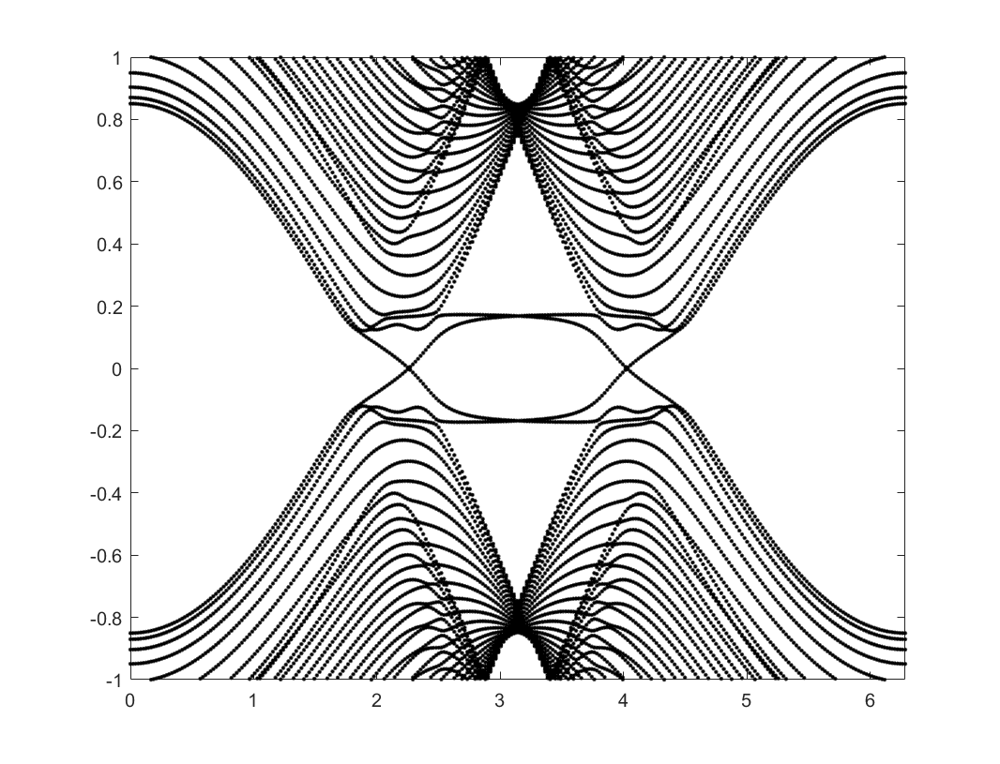
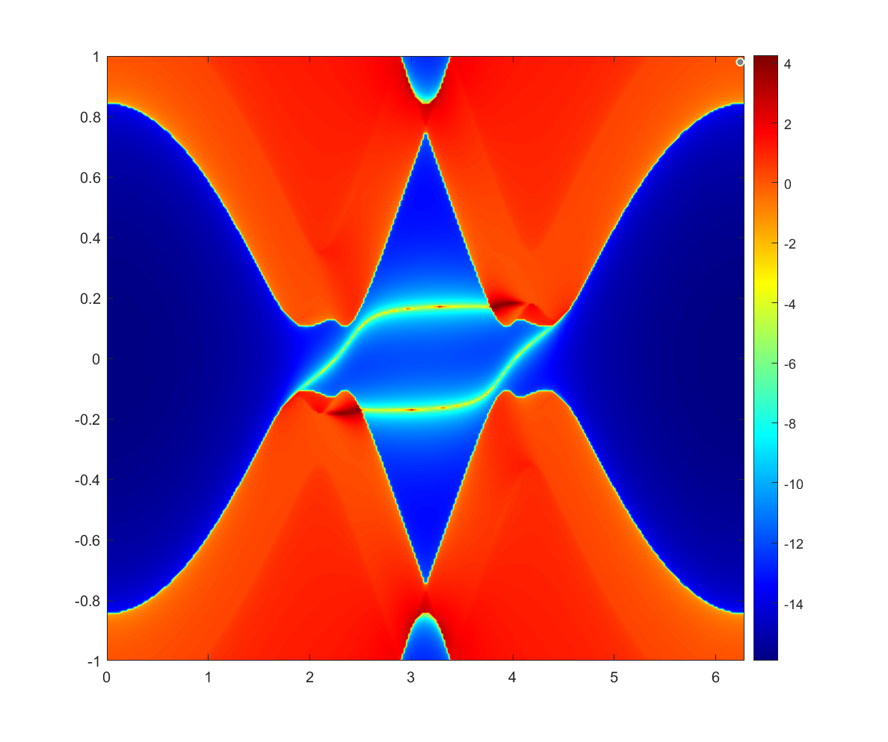

#! https://zhuanlan.zhihu.com/p/683330560
# Matlab构建System Graph
> 这篇文章主要是使用matlab去构造系统的图

在篇文章只考虑TB-Model，至于ribbon和bulk的情况之后再说。

## Graph in Matlab
matlab 提供了非常丰富的定义和修改图论的函数，其中最关键的几个函数分别是`graph`，`findnode`，`neighbors`，`distances`和`adjacency`。
+ `graph`：被用来创建图
+ `findnode`：用来查询点在图的位置，在接导线和画图的时候很好用
+ `neignbors`：用来查询该site周边的site
+ `distances`：图距离，基础分层最核心的函数
+ `adjacency`：该函数将图变成计算所需的矩阵
----
## How to Build a System
从matlab帮助文档里，我们可以快速学会如何如构造一个图。但如何去优雅的将一个TB-Model去map为一个图呢？这一块我认为`kwant`的做法就非常physics。他将晶格结构和hopping分离开，首先通过晶格矢量去定义布拉菲格子，之后去定义格子直接的hopping，(先把点画出来，之后画线)。在`kwant`里这几部被定义为类，在matlab里同样可以这样干（后来发现matlab`for`循环处理`class`要慢的多，之后不得不使用`cellfun`等函数）。

我们想通过这样的写法来定义一个hopping，其中`A`是一个Lattice，`syst`是一个系统(类似与一个画布)，这种写法的优点就是非常直观(物理)。
```matlab
syst(A(1,1),A(1,2))=1;  % hopping: A(1,1) --> A(1,2)
```

### Monatomic
首先定义单原子Lattice，该class有5个properties
+ `prim_vecs`: 晶格矢量
+ `names`: 晶格名字
+ `basises`: 原点离晶格的位置
+ `orbits`: 每个site的轨道数
+ `shape`: Lattice的形状，必须是`polyshape`

同时有4个Methods:
+ `site_tag`返回一个结构体
```matlab
A = Monatomic([1,0;0,1],"A");
A.site_tag(1,1)    % return a struct
%{ 
    pos: [1,1]
    site_family: "A"
    tag:"A(1,1)"
%}
```
+ `subsref`是为了简化`site_tag`的使用，`A.site_tag(1,1)--->A(1,1)`
```matlab
A = Monatomic([1,0;0,1],"A");
A(1,1)    % return a struct
%{ 
    pos: [1,1]
    site_family: "A"
    tag:"A(1,1)"
%}
```
+ `pos`返回坐标`A.pos(1,1) % [1,1]`，该函数被`site_tag`调用
+ `LatInShape`返回Lattice`shape`内的tag，只有当`shape`不为空时可用


```matlab
classdef Monatomic
    properties
        prim_vecs;
        names;
        basises;
        orbits;
        shape;
    end
    methods
        function obj = Monatomic(prim_vecs, name, offset,orbits)
            arguments
                prim_vecs       single
                name            string
                offset  (1,2)   single = [0,0];
                orbits  (1,1)   single = 1;
            end
            obj.prim_vecs = prim_vecs;
            obj.names = name;
            obj.basises = offset;
            obj.orbits = orbits;
        end
        function result = subsref(obj, S)
            if strcmp(S(1).type, '()') && max(size(obj)) == 1 ...
                    && isa(obj,'TB_Hamilton.Monatomic')
                result = obj.site_tag(S.subs{:});
            else
                if size({S.subs},2)>1
                    prop = S(1).subs;
                    result = obj.(prop)(S(2).subs{:});
                else
                    prop = S(1).subs;
                    result = obj.(prop);
                end
            end
        end
        function result = site_tag(obj,x,y)
                if length(x(:)) ~=length(y(:))
                    [x,y] = meshgrid(x,y);
                end
                len = length(x);
                input = [x(:) y(:)];
                poses = obj.pos(input);
                str1 = obj.names+"("+join(string(input),',')+")";
                result.pos = poses(1,:);
                result.site_family = obj.names;
                if obj.orbits == 1
                    result.tag = str1(1);
                    for j1 = 2:len
                        result(j1).pos = poses(j1,:);
                        result(j1).tag = str1(j1);
                        result(j1).site_family = obj.names;
                    end
                else
                    result.tag = str1(1)+"_"+ string(1:obj.orbits);
                    for j1 = 2:len
                        result(j1).pos = poses(j1,:);
                        result(j1).tag = str1(j1)+"_"+ string(1:obj.orbits);
                        result(j1).site_family = obj.names;
                    end
                end
                result = result';
        end
        function result = pos(obj,tag)
            arguments
                obj TB_Hamilton.Monatomic
                tag (:,2) single
            end
            result = tag * obj.prim_vecs + obj.basises;
        end
        function lat_tag = LatInShape(obj)
            arguments
                obj     TB_Hamilton.Monatomic;
            end
            if ~isa(obj.shape,'polyshape')
                error("Only LatInShape can be used when the shape is well defined.");
            end
            [bx,by] = boundary(obj.shape);
            mn = ceil(max(abs(([bx by] - obj.basises)/obj.prim_vecs)));
            [M,N] = meshgrid(-mn(1):mn(1),-mn(2):mn(2));
            Pointx = M * obj.prim_vecs(1,1) + N * obj.prim_vecs(2,1) + obj.basises(1);
            Pointy = M * obj.prim_vecs(1,2) + N * obj.prim_vecs(2,2) + obj.basises(2);
            in = inpolygon(Pointx,Pointy,bx,by);
            lat_tag = [M(in),N(in)];
        end
    end
end
```

### Polyatomic
多原子晶格用`Polyatomic`来构造，最关键的Properties是`sublattice`，他的逻辑是将多原子晶格变成多个单原子sublattice。
```matlab
% Graphene
vec = [-sqrt(3)/2 , 3/2; sqrt(3)/2,3/2];
basis = [0,0;sqrt(3)/2,1/2];
name = ["A","B"];
nx = 20; ny = 20;
lat = Polyatomic(vec,name,basis,[2,2]);
A = lat.sublattice{1};
B = lat.sublattice{2};
%{
    lat = 
    Polyatomic - 属性:
    prim_vecs: [2×2 single]
    sublattice: {[1×1 TB_Hamilton.Monatomic]  [1×1 TB_Hamilton.Monatomic]}
         names: ["A"    "B"]
        orbits: [2 2]
       basises: [2×2 single]
         shape: []
%}
```

```matlab
classdef Polyatomic
    properties
        prim_vecs;
        sublattice;
        names;
        orbits;
        basises;
        shape;
    end
    methods
        function obj = Polyatomic(prim_vecs, basis, name,orbits)
            arguments
                prim_vecs       single
                basis           single
                name            string
                orbits          single = ones(1,length(name));
            end
            obj.prim_vecs = prim_vecs;
            len = length(basis);
            obj.names = name;
            obj.sublattice = {};
            obj.orbits = orbits;
            obj.basises = basis;
            for j1 = 1:len
                obj.sublattice{end+1} = ...
                    TB_Hamilton.Monatomic(prim_vecs, obj.names(j1), basis(j1,:),orbits(j1));
            end
        end
        function obj = set.shape(obj,region)
            if ~isa(region,'polyshape')
                error("Only LatInShape can be used when the shape is well defined.");
            end
            obj.shape = region;
            for j1 = 1:length(obj.sublattice)
                obj.sublattice{j1}.shape = obj.shape;
            end
        end
    end
end
```

### Builder
`Builder`被用来构造系统，在文章开头的`syst`就是一个`Builder`。他做的事情是将`A(1,1)-->A(1,2)`map为一个图。现在我们知道`A(1,1)`包含了`pos`,`tag`,`site_family`，我这里是选用了`tag`来构造图(因为tag是string，所以用tag来构造图所用内存将大一点，这是为了物理直观所牺牲的)。我的思路是将`syst(A(1,1),A(1,2))=1`变为`graph(A(1,1).tag,A(1,2).tag,1)`最后的1是图的边权重。

## Example
> PRB_161414_2010
$$
H=-t\sum_{\langle ij\rangle}c_{i\alpha}^\dag c_{j\alpha}+it_{so}\sum_{\langle ij\rangle}(\sigma_{\alpha\beta}\times d_{ij})c_{i\alpha}^\dag c_{j\beta}+\lambda\sum_{i\alpha}c_{i\alpha}^\dag \sigma_z c_{i\beta}
$$




```matlab
%%
clc;clear;close all;
% import TB_Hamilton.*
tic
vec = [-sqrt(3)/2 , 3/2; sqrt(3)/2,3/2];
% vec = [1,0;0,1];
basis = [0,0;sqrt(3)/2,1/2];
name = ["A","B"];
% name = ["A"];
nx = 20; ny = 20;
lat = TB_Hamilton.general(vec,name,basis,[2,2]);
A = lat.sublattice{1};
B = lat.sublattice{2};
syst = TB_Hamilton.Builder(lat);
t = 1;  lam = 0.18;  tso = 0.1;
sz = [1,0;0,-1];    sx = [0,1;1,0]; sy = [0,-1i;1i,0];
% onsite
[xx,yy] = meshgrid(0:nx,0:ny);
syst(A(xx(:),yy(:))) = lam * sz;

[xx,yy] = meshgrid(0:nx,-1:ny-1);
syst(B(xx(:),yy(:))) = lam * sz;

% hopping
[xx,yy] = meshgrid(0:nx,0:ny-1);
d = B.pos([1,1]) - A.pos([1,1]);
syst(A(xx(:),yy(:)),B(xx(:),yy(:))) = -t*eye(2)+1i*tso*(sx*d(2)-sy*d(1));

[xx,yy] = meshgrid(0:nx,-1:ny-1);
d = A.pos([1,2]) - B.pos([1,1]);
syst(B(xx(:),yy(:)),A(xx(:),yy(:)+1)) = -t*eye(2)+1i*tso*(sx*d(2)-sy*d(1));

[xx,yy] = meshgrid(0:nx-1,0:ny);
d = B.pos([2,0]) - B.pos([1,1]);
syst(A(xx(:),yy(:)),B(xx(:)+1,yy(:)-1)) = -t*eye(2)+1i*tso*(sx*d(2)-sy*d(1));
% Lead1
lead1 = TB_Hamilton.Builder(lat,[0,-1]);
[xx,yy] = meshgrid(0:nx,-1);
d = B.pos([1,1]) - A.pos([1,1]);    
lead1(A(0:nx,-1)) = lam * sz;    lead1(B(0:nx,-2)) = lam * sz;
lead1(A(xx(:),yy(:)),B(xx(:),yy(:))) = -t*eye(2)+1i*tso*(sx*d(2)-sy*d(1));
[xx,yy] = meshgrid(0:nx,-2);
d = A.pos([1,2]) - B.pos([1,1]);
lead1(B(xx(:),yy(:)),A(xx(:),yy(:)+1)) = -t*eye(2)+1i*tso*(sx*d(2)-sy*d(1));
% 
[xx,yy] = meshgrid(0:nx-1,-1);
d = B.pos([2,0]) - A.pos([1,1]);
lead1(A(xx(:),yy(:)),B(xx(:)+1,yy(:)-1)) = -t*eye(2)+1i*tso*(sx*d(2)-sy*d(1));
syst.attach_lead(lead1);

% Lead2
lead2 = TB_Hamilton.Builder(lat,[0,1]);
[xx,yy] = meshgrid(0:nx,ny);
B1 = B(1,1); A1 = A(1,1);
d = B1.pos - A1.pos;
lead2(A(0:nx,ny+1)) = lam * sz;    lead2(B(0:nx,ny)) = lam * sz;

lead2(A(xx(:),yy(:)),B(xx(:),yy(:))) = -t*eye(2)+1i*tso*(sx*d(2)-sy*d(1));
[xx,yy] = meshgrid(0:nx,ny);
B1 = A(1,2); A1 = B(1,1);
d = B1.pos - A1.pos;
lead2(B(xx(:),yy(:)),A(xx(:),yy(:)+1)) = -t*eye(2)+1i*tso*(sx*d(2)-sy*d(1));
[xx,yy] = meshgrid(0:nx-1,ny+1);

B1 = B(2,0); A1 = B(1,1);
d = B1.pos - A1.pos;
lead2(A(xx(:),yy(:)),B(xx(:)+1,yy(:)-1)) = -t*eye(2)+1i*tso*(sx*d(2)-sy*d(1));
syst.attach_lead(lead2);
syst.finalized()

TB_Hamilton.Plot.ScatterRegion(syst,MarkerFaceColor=["k","b"]);
```

### Ribbon system


```matlab
syst = TB_Hamilton.Builder(lat,[0,1]);
model1_hopping(syst,lats,0:30,0:5,tso=.1,lam=.18);
syst.finalized
figure()
TB_Hamilton.Plot.ScatterRegion(syst);
```

```matlab
num = 100;
k = linspace(0,2*pi,300);
Es = zeros(num,length(k));
for j1 = 1:length(k)
    H = syst.Hamilton(k(j1));
    Es(:,j1) = eigs(H,num,'smallestabs');
end
plot(k,Es,'k.');
ylim([-1,1]);
xlim([0,2*pi])
```

```matlab
S_GF = TB_Hamilton.GreenFunction.SurfaceGF(syst,[-1,0]);
k = linspace(0,2*pi,300);   Es = linspace(-1,1,300);
rho = zeros(length(Es),length(k));
nEs = length(Es);
parfor j1 = 1:length(k)
    k0 = k(j1);
    for j2 = 1:nEs
        rho(j2,j1) = trace(S_GF.SGF(Es(j2),k0));
    end
end
figure()
[EE,KK] = meshgrid(Es,k);
contourf(KK,EE,log(-(imag(rho)))',256,'LineColor','none')
colormap("jet")
colorbar
ylim([-1,1])
```

```matlab
function model1_hopping(syst,lats,nx,ny,options)
    arguments
        syst    TB_Hamilton.Builder;
        lats    ;
        nx      double;
        ny      double;
        options.t       double =1;
        options.tso     double;
        options.lam     double;
        options.mu      double=0;
    end
    import TB_Hamilton.SOC;
    [x,y] = meshgrid(nx,ny);
    x = x(:);   y = y(:);
    sz = [1,0;0,-1];    
    for j1 = 1:length(lats)
        syst(lats{j1}(x,y)) = options.lam * sz + options.mu*eye(2);
    end
    syst(lats{1}(x,y),lats{2}(x,y)) = -options.t * eye(2) + 1i * options.tso * SOC(lats{1}(1,1),lats{2}(1,1));
    
    [x,y] = meshgrid(nx(1:end-1),ny);
    x = x(:);   y = y(:);
    if ~isempty(x)
        syst(lats{2}(x,y),lats{1}(x+1,y)) = -options.t * eye(2) + 1i * options.tso * SOC(lats{2}(1,1),lats{1}(2,1));
    end
    [x,y] = meshgrid(nx,ny(1:end-1));
    x = x(:);   y = y(:);
    if ~isempty(y)
        syst(lats{2}(x,y),lats{1}(x,y+1)) = -options.t * eye(2) + 1i * options.tso * SOC(lats{2}(1,1),lats{1}(1,2));
    end
end
```
