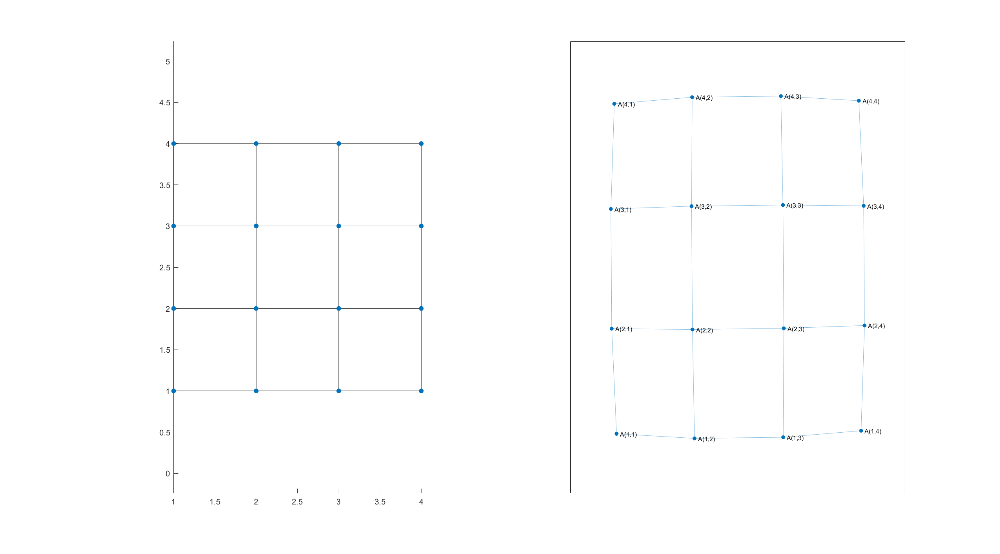
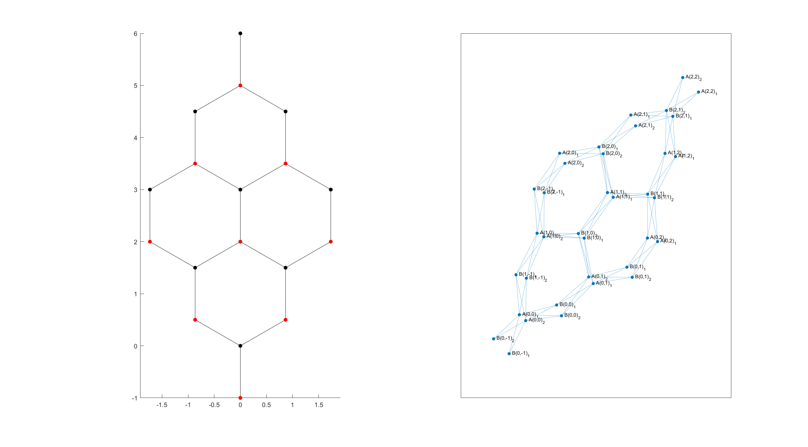
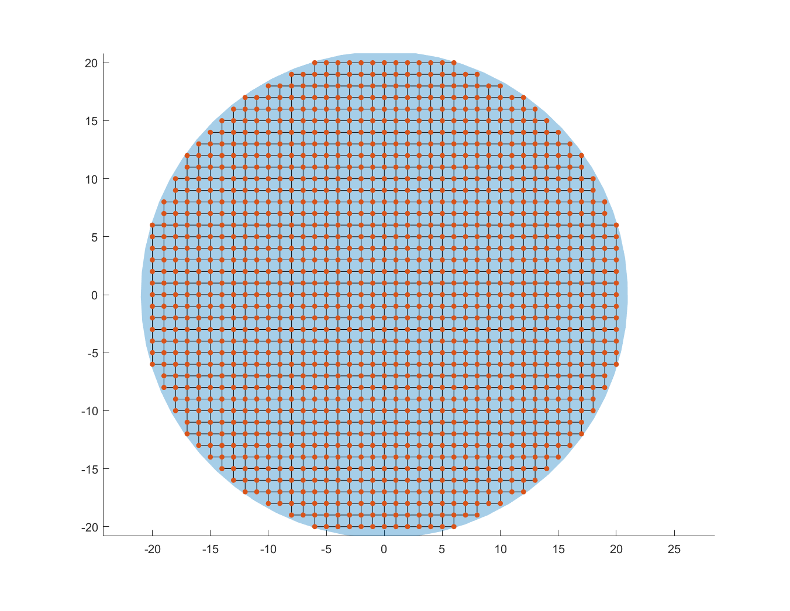
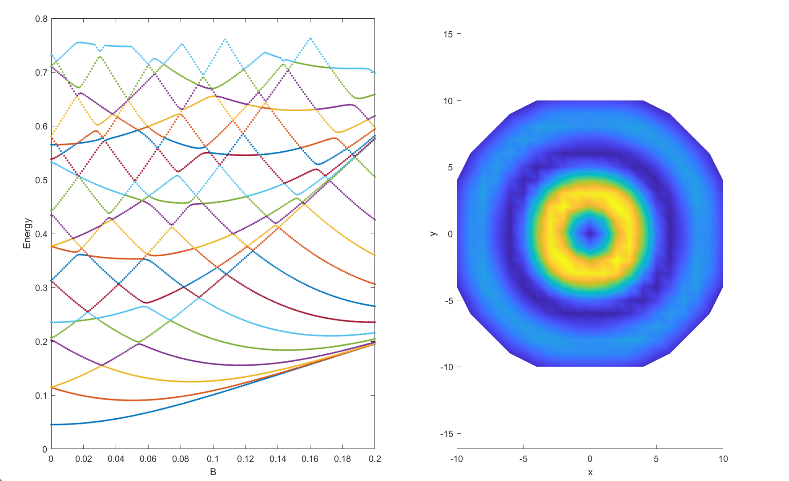

#! https://zhuanlan.zhihu.com/p/683250048
# 图论在凝聚态物理的应用
> 在这几篇文章中我想介绍图论在凝聚态物理的应用，包括code的实现。


我们所接触的问题大多是直接丢给你一个哈密顿量，无论是连续实空间还是k空间的哈密顿量都可以转换为tight binding model(TB-Model)。TB-Model(平均场后)本质上就是一个矩阵，而图论就是一个为稀疏矩阵服务的理论。

## Why Graph
首先，为什么用图论：如果知道TB-Hamiltonian，我们就可以直接写出他的矩阵形式，那么为什么需要用Graph呢？有几个明确的优点**code简洁**，**通用**和**速度快**：

+ 通用性

左图是系统在site空间的表示，右图是他的图表示。在右图中A被当作晶格名字，$A(1,1)$表示晶格$A$的第$(1,1)$个site。



+ 速度快

在做输运计算时，我们经常会遇到大矩阵的求逆，逆运算时间复杂度通常是矩阵大小的三次方，所以通常将大矩阵分成小矩阵的方法来提高速度。而利用图距离可以很快做到分层！

## Example
Hamiltonian
$$
\begin{align}
H=\sum_{i}4tc_{i}^\dag c_i-\sum_{ij}te^{-iA_{ij}}c_i^\dag c_j \hspace{1cm} A_x(y)=-By,A_y(x)=0
\end{align}
$$




```matlab
clc;clear;close all;
import TB_Hamilton.*;
vec = [1,0;0,1];    name = "A"; 
lat = general(vec,name);
t = 0.05:0.1:2*pi;
x1 = 11 * cos(t);
y1 = 11 * sin(t);
pgon1 = polyshape(x1,y1);
lat.shape = pgon1;
syst = Builder(lat);
syst.finalized();

plot(lat.shape,"LineStyle","none");
hold on;
TB_Hamilton.Plot.ScatterRegion(syst,SizeData=20,LineWidth=1)

B = linspace(0,.2,200);
Es = zeros(20,length(B));
for j1 = 1:length(B)
    syst = system(lat,B(j1));
    H = syst.Hamilton;
    Es(:,j1) = eigs(H,20,'sm');
end
tiledlayout(1,2,'TileSpacing','Compact','Padding','compact')
nexttile;
plot(B,Es,'.');
xlabel("B");    ylabel('Energy');

syst = system(lat,.001);
H = syst.Hamilton;
[V,D] = eigs(H,50,'sm');
rho = abs(V(:,10)).^2;
nexttile;
TB_Hamilton.Plot.Density(syst.ham_pos,rho)
xlabel('x');ylabel('y')

function P = potential(site1,site2,B)
    y = cell2mat({site1.pos}');
    P = {-exp(-1i*B*y(:,2))};
end
function syst = system(lat,B)
    import TB_Hamilton.Builder;
    syst = Builder(lat);
    t = 1;
    syst(Builder.HoppingKind(lat,lat,[0,0])) = 4 * t;
    syst(Builder.HoppingKind(lat,lat,[0,1])) = -t;
    syst(Builder.HoppingKind(lat,lat,[1,0])) = @(x,y) potential(x,y,B);
    syst.finalized();
end
```

> 这个文章大致介绍了图论的优点，及给出了几个例子，在之后还会介绍matlab如何定义一个系统的图(code里的Builder)